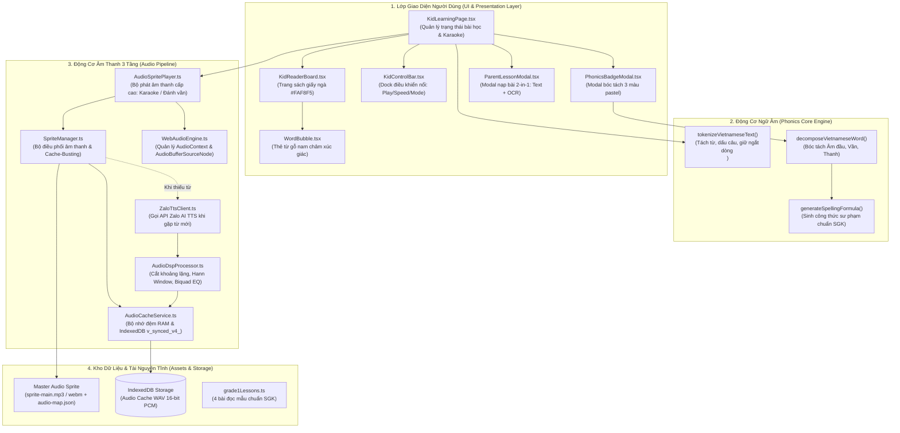
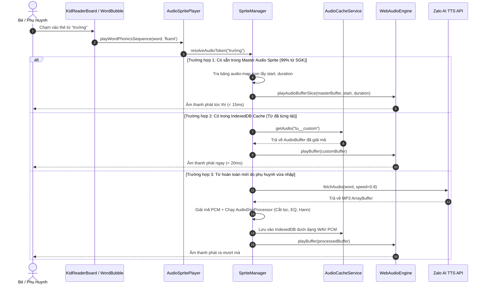

# Kiến Trúc Hệ Thống (System Architecture Guide)

Tài liệu này cung cấp bức tranh toàn cảnh về kiến trúc kỹ thuật của **App Học Đánh Vần Tiếng Việt Lớp 1**, phục vụ cho các kỹ sư mới hoặc khi bạn quay lại bảo trì/mở rộng dự án sau 6 tháng.

---

## 1. Sơ Đồ Kiến Trúc Tổng Thể (High-Level Architecture)

---

## 2. Luồng Phát Âm Thanh Chi Tiết (Audio Playback Flow)

Khi người dùng nhấn vào một từ hoặc nhấn nút **Phát Toàn Bài (Play)**, chu trình diễn ra như sau:

---

## 3. Kiến Trúc Từng Phân Hệ Cốt Lõi

### 3.1. Phân Hệ Ngữ Âm (`src/core/parser/vietnamesePhonics.ts`)
Là trái tim của ứng dụng, hoàn toàn độc lập với UI:
* **`tokenizeVietnameseText(rawText: string): Token[]`**:
  * Chuyển đổi một bài đọc phức tạp thành danh sách các token: từ ngữ (`word`), dấu ngắt câu (`punctuation`), và ngắt dòng (`newline`).
  * Giúp các bài thơ 4 chữ, 5 chữ giữ trọn vẹn nhịp điệu và không bị xô lệch vị trí.
* **`decomposeVietnameseWord(word: string): PhonicsBreakdown`**:
  * Phân rã từ thành 3 thành phần ngữ âm:
    * `initial`: Phụ âm đầu (hoặc rỗng nếu từ bắt đầu bằng nguyên âm).
    * `rime`: Vần (được chuẩn hóa về thanh ngang).
    * `tone`: 1 trong 6 dấu thanh (`ngang`, `huyen`, `sac`, `hoi`, `nga`, `nang`).
* **`generateSpellingFormula(...)`**:
  * Áp dụng quy tắc sư phạm Bộ GD&ĐT: Tự động chèn bước đệm thanh sắc cho các vần khép tắc $p, t, c, ch$ đi với thanh nặng.

### 3.2. Phân Hệ Âm Thanh (`src/core/audio/`)
* **[`SpriteManager.ts`](file:///d:/Workspace/web_apps/app_hoc_danh_van/src/core/audio/SpriteManager.ts)**:
  * Singleton quản lý tải và giải mã file Master Sprite `sprite-main.mp3` và `audio-map.json`.
  * Quản lý hằng số `SPRITE_VERSION = 'v4.2.0'` để kích hoạt tính năng **Cache-Busting** qua tham số query URL, ngăn chặn triệt để tình trạng trình duyệt lưu cache file âm thanh cũ.
  * Bản đồ ánh xạ `TOKEN_TO_SPRITE_KEY_MAP`: Chuyển đổi từ vựng hiển thị sang key tương ứng trong sprite (ví dụ `'em' -> 'tu__em'`, `'lo' -> 'tu__lo'`, `'hỏi' -> 'tu__hoi'`).
* **[`AudioDspProcessor.ts`](file:///d:/Workspace/web_apps/app_hoc_danh_van/src/core/audio/AudioDspProcessor.ts)**:
  * Khử tiếng nổ MP3 Header bằng cách làm sạch 64 mẫu đầu tiên.
  * Cắt khoảng lặng thông minh với **50ms pre-roll** và **140ms decay-tail**.
  * Biquad Peaking EQ (tăng ấm áp 220Hz, giảm chói 3.6kHz).
  * Hann Windowing 12ms triệt tiêu xung kích điện.
* **[`AudioSpritePlayer.ts`](file:///d:/Workspace/web_apps/app_hoc_danh_van/src/core/audio/AudioSpritePlayer.ts)**:
  * Quản lý tiến trình đọc trơn (Karaoke) và tiến trình đánh vần tuần tự.
  * Tự động tính toán khoảng dừng giữa các từ (`silenceGap`) tùy theo chế độ tốc độ Thỏ (0.8x) hay Rùa (0.6x) và dừng lâu hơn tại dấu chấm, dấu phẩy.
  * Dừng dứt khoát trong 3ms khi người dùng nhấn nút Stop (không để lại âm thanh dư thừa).

### 3.3. Phân Hệ Giao Diện Bé Học (`src/components/kid/`)
* **[`KidLearningPage.tsx`](file:///d:/Workspace/web_apps/app_hoc_danh_van/src/pages/KidLearningPage.tsx)**:
  * Giữ state trung tâm của ứng dụng: bài học hiện tại, danh sách token, chỉ số từ đang được đọc (`activeTokenIndex`), trạng thái đang phát (`isPlaying`), tốc độ đọc (`playbackSpeed`), chế độ đọc (`readingMode`).
  * Lưu trạng thái bài học gần nhất vào `localStorage` để bé mở lại là học được ngay.
* **[`KidReaderBoard.tsx`](file:///d:/Workspace/web_apps/app_hoc_danh_van/src/components/kid/KidReaderBoard.tsx)**:
  * Hiển thị trang sách giấy ngà `#FAF8F5`.
  * Render các dòng thơ hoặc đoạn văn, tự động gom nhóm các từ thành dòng dựa trên token `newline`.
* **[`WordBubble.tsx`](file:///d:/Workspace/web_apps/app_hoc_danh_van/src/components/kid/WordBubble.tsx)**:
  * Khối gỗ nam châm xúc giác đại diện cho từng từ.
  * Hỗ trợ 2 cử chỉ tương tác:
    * **Chạm nhanh (Click):** Phát âm thanh đọc trơn hoặc mở đánh vần.
    * **Nhấn vào icon kính lúp / Chạm lâu:** Mở bảng bóc tách ngữ âm 3 màu pastel.

---

## 4. Quản Lý Bộ Nhớ & Tối Ưu Hiệu Năng (Performance & Memory)

1. **Một AudioContext Duy Nhất (Single Context Pattern):** Toàn bộ ứng dụng chia sẻ duy nhất một `AudioContext` thông qua `WebAudioEngine`. Tránh lỗi rò rỉ bộ nhớ hoặc bị trình duyệt chặn phát âm thanh (Autoplay Policy).
2. **Giải mã một lần vào RAM:** File `sprite-main.mp3` (1020KB) sau khi giải mã chiếm $\sim 15\text{MB}$ RAM AudioBuffer. Mọi thao tác cắt đoạn phát đều là tham chiếu con trỏ thời gian (Offset Pointer), không nhân bản dữ liệu, tiêu tốn 0% CPU khi chuyển từ.
3. **Lazy-Load OCR Model:** Thư viện `tesseract.js` và model ngôn ngữ chỉ được nạp khi phụ huynh mở tab quét ảnh, giữ dung lượng bundle ban đầu siêu nhẹ.
